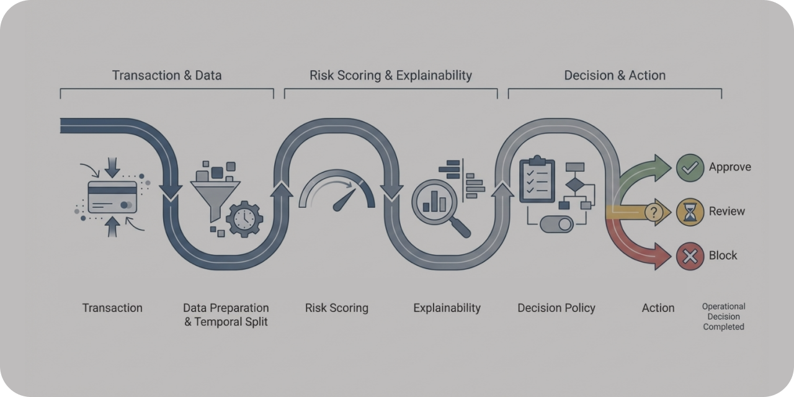

# FraudWatch

**Risk scoring e priorização de alertas para sistemas antifraude e AML baseados em Machine Learning.**




---

## Visão Geral

Este é um **case técnico de Machine Learning aplicado à priorização de alertas de fraude**.

O projeto trata o modelo como um **motor de geração de scores de risco**, separando explicitamente três camadas fundamentais de sistemas de risco:

- previsão (**risk score**);
- decisão (**policy de approve / review / block**);
- evolução do modelo ao longo do tempo.

Embora o dataset utilizado seja de fraude em cartão, a arquitetura proposta é aplicável a outros domínios de **risco transacional**, como **Prevenção à Lavagem de Dinheiro (PLD/AML)** e **análise de risco de crédito**.

---

## Problema de Negócio

Empresas que operam com grandes volumes de transações financeiras enfrentam desafios como:

- fraudes que passam despercebidas (**falsos negativos**);
- clientes legítimos bloqueados (**falsos positivos**);
- limitação de capacidade humana para análise manual;
- forte desbalanceamento entre eventos legítimos e fraudulentos.

O projeto busca priorizar eventos com maior risco, permitindo que equipes concentrem esforços nos casos de maior impacto operacional.

---

## Abordagem Atual

A implementação atual contempla um pipeline completo de **risk scoring**:

- auditoria e análise exploratória do histórico de transações;
- divisão **temporal** em treino, validação e teste;
- treinamento de modelo baseline (**Logistic Regression**);
- treinamento e seleção de modelo principal (**LightGBM vs XGBoost**);
- avaliação com métricas relevantes para fraude:
  - Recall;
  - Precision;
  - PR-AUC;
  - matriz de confusão;
- análise de explicabilidade com **SHAP**;
- definição explícita de **política de decisão** baseada em score;
- persistência de artefatos analíticos e modelos.

---

## Tecnologias Utilizadas

- Python
- Pandas / NumPy
- Scikit-learn
- LightGBM
- XGBoost
- SHAP
- Matplotlib / Seaborn

---

## Pipeline Analítico

1. Auditoria do histórico de transações  
2. Análise exploratória orientada à detecção de fraude  
3. Divisão temporal em treino, validação e teste  
4. Treinamento e avaliação de modelos candidatos  
5. Seleção do modelo campeão  
6. Definição de política de decisão baseada em score  
7. Avaliação de trade-offs operacionais  
8. Persistência de modelos, métricas e regras de decisão  

---

## Estrutura do Projeto

```

fraudwatch/

├── data/
│   ├── raw/
│   └── processed/
│
├── src/
│   ├── evaluation.py
│   ├── paths.py
│   └── utils.py
│
├── notebooks/
│   ├── 01-data_audit_eda.ipynb
│   ├── 02-train_baseline.ipynb
│   ├── 03-train_main_model.ipynb
│   └── 04-policy_decisioning.ipynb
│
├── models/
│   ├── baseline_logreg.pkl
│   └── champion_lightgbm.pkl
│
├── references/
│   ├── 01_dicionario_de_dados.md
│   └── fraudwatch-results.png
│
├── reports/
│   ├── metrics/
│   ├── policy/
│   ├── analysis/
│   └── plots/
│
└── README.md

```

---

## Resultados

A implementação atual entrega:

- modelo baseline e modelo campeão treinados e avaliados;
- geração de **scores de risco**;
- política de decisão explícita baseada em thresholds;
- análise de trade-offs entre falsos positivos e falsos negativos;
- artefatos persistidos para rastreabilidade do processo decisório.

---

## Como executar

### Ambiente

O projeto utiliza **uv** para gerenciamento do ambiente virtual e das dependências.

```bash
uv sync
```

Para executar os notebooks, utilize o ambiente criado pelo `uv` como interpretador Python no VS Code ou execute o Jupyter pelo ambiente do projeto:

```bash
uv run jupyter lab
```

---

## Status

**Case técnico em evolução.**

A implementação atual possui o pipeline de modelagem, avaliação, risk scoring, política de decisão e explicabilidade. 

---

## Disclaimer

Esta POC foi desenvolvida exclusivamente para fins demonstrativos.

Os dados utilizados são públicos e não contêm informações pessoais ou sensíveis.  
O projeto não deve ser utilizado diretamente em ambientes produtivos.

---

## Small Data Lab – Portfolio

Este projeto faz parte do **Small Data Lab**, um laboratório técnico dedicado à experimentação aplicada em dados, analytics e sistemas de IA.

Explore também outras POCs do laboratório:
  
- [LakeFlow](https://github.com/smalldatalabbr/lakeflow) — Pipeline Lakehouse para ingestão e organização de dados externos.  
- [RetailLens BI](https://github.com/smalldatalabbr/retaillens-bi) — Camada analítica BI-ready para diagnóstico operacional em e-commerce.  
- [DelayImpact](https://github.com/smalldatalabbr/delayimpact-analytics) — Análise que investiga o impacto de atrasos logísticos na satisfação do cliente.  
- [CampaignSense](https://github.com/smalldatalabbr/campaignsense) — CRM Analytics para priorização de campanhas baseada em propensão e ROI.    
- [DocLens](https://github.com/smalldatalabbr/doclens) — Chatbot RAG com guardrails e testes adversariais para governança de LLMs.
---

## Onde me encontrar

[Portfólio](https://jhonathan.me) | [LinkedIn](https://www.linkedin.com/in/jhonathandomingues) | [Email](mailto:hello@jhonathan.me)

---

Este repositório é licenciado sob a MIT License.
